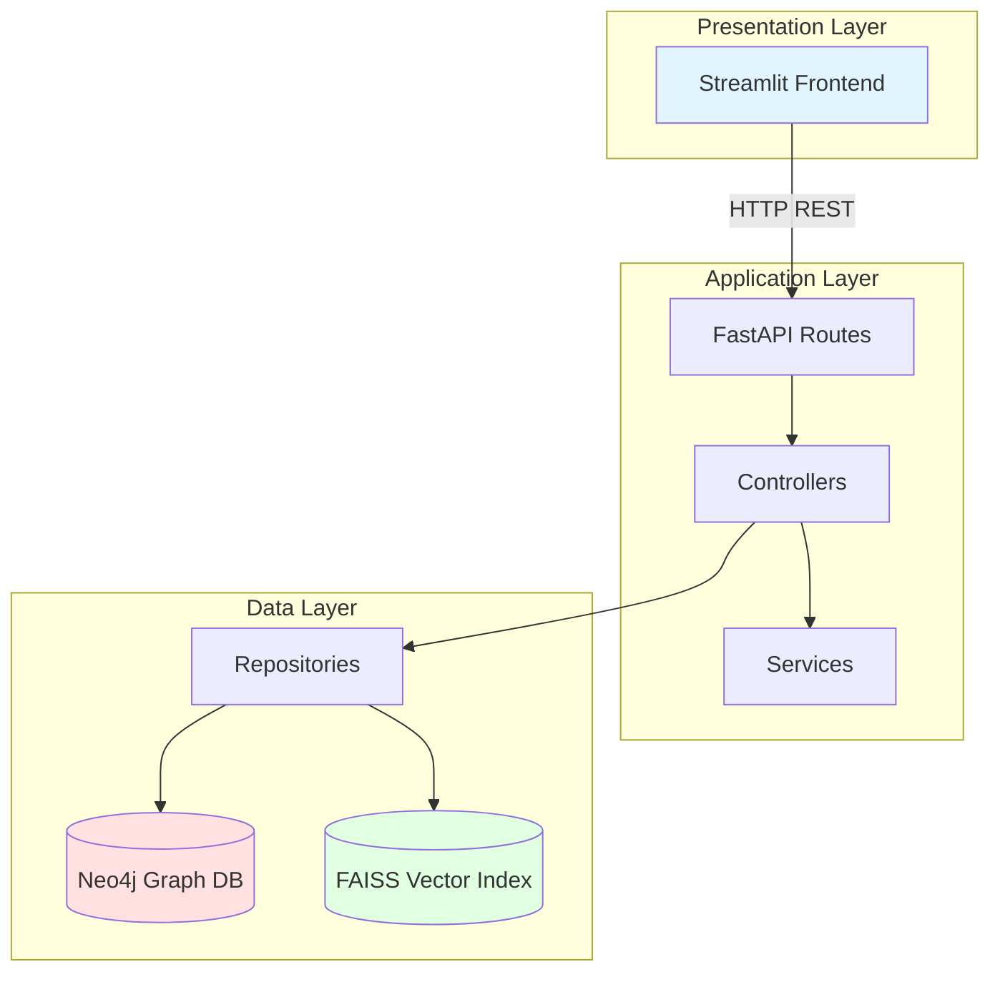
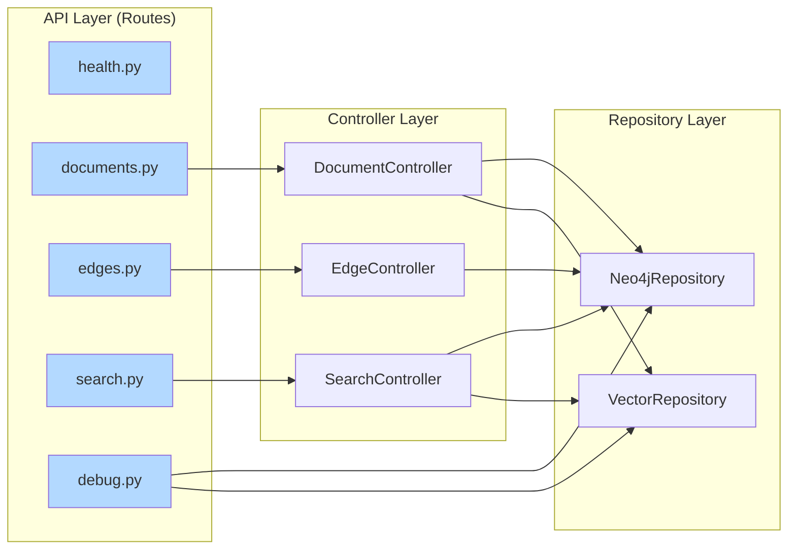
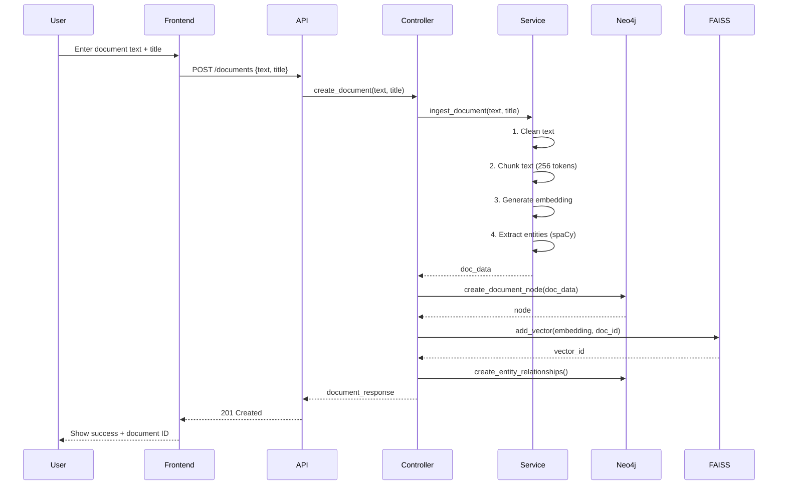
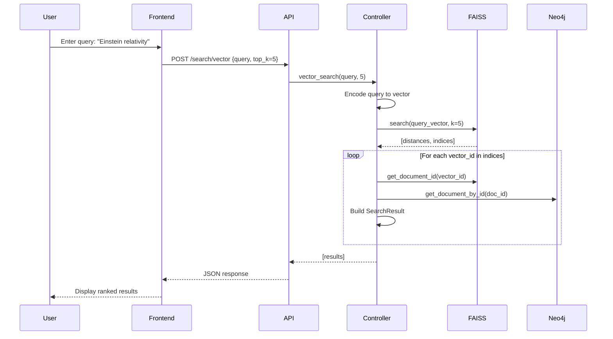
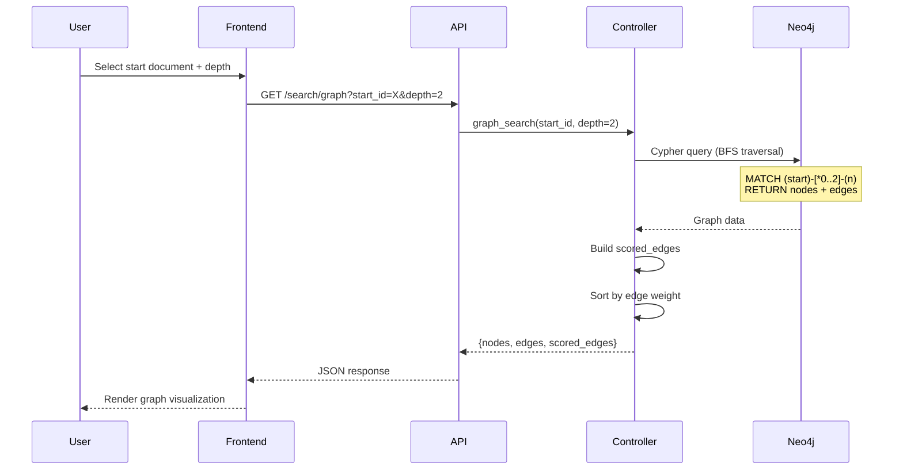
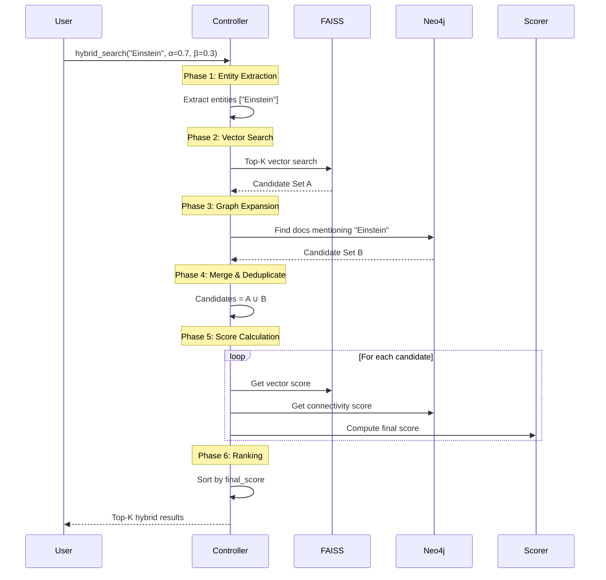
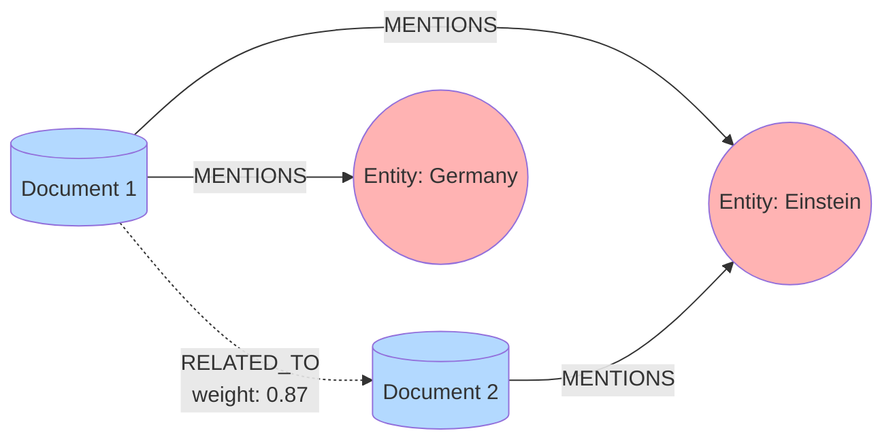
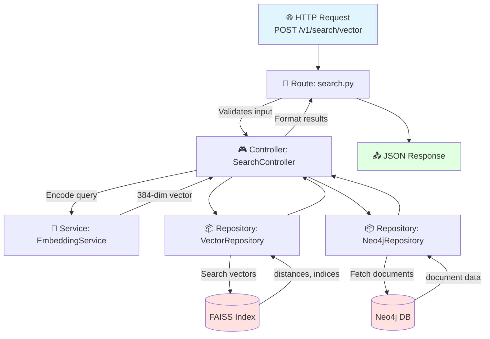
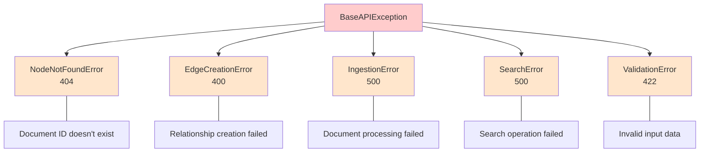

# 🏛️ System Architecture 


## 🎯 What Does This System Do?

This is a **smart search engine** that finds documents using two complementary approaches:

1. **Vector Search**: Understands the *meaning* of your query (semantic search)
2. **Graph Search**: Explores *connections* between documents and entities

By combining both, you get search results that are both semantically relevant AND contextually connected.

---

## 🏠 The Big Picture

The system implements a **three-tier architecture** with clear separation of concerns:



**What Each Layer Does:**

| Layer | Components | Purpose |
|-------|-----------|----------|
| **Presentation** | Streamlit UI | What you see and interact with |
| **Application** | FastAPI, Controllers, Services | Processes your requests |
| **Data** | Repositories, Neo4j, FAISS | Stores and retrieves data |

---

## 🧱 Backend Architecture: The MVC Pattern

The backend follows the **MVC (Model-View-Controller)** pattern, but adapted for APIs. Think of it as a **layered cake** - each layer has a specific job:



**How Data Flows:**
1. **Routes** receive HTTP requests and validate input
2. **Controllers** contain business logic and coordinate operations
3. **Repositories** talk to databases (Neo4j & FAISS)

### Why This Structure?

| Layer | Responsibility | Why Separate? |
|-------|---------------|---------------|
| **Routes** | HTTP handling | Easy to change API endpoints |
| **Controllers** | Business logic | Logic stays in one place |
| **Repositories** | Data access | Can swap databases easily |
| **Services** | Utilities | Reusable across controllers |

---

## 📁 Folder Structure Explained

```
app/
├── main.py              ← Application entry point
├── config.py            ← Configuration settings
├── database.py          ← Database connections
│
├── api/                 ← API LAYER
│   ├── routes/          ← HTTP endpoints
│   │   ├── health.py    ← Health check endpoint
│   │   ├── documents.py ← Document CRUD
│   │   ├── edges.py     ← Relationship management
│   │   ├── search.py    ← Search endpoints
│   │   └── debug.py     ← Debug tools
│   └── dependencies.py  ← Dependency injection setup
│
├── controllers/         ← BUSINESS LOGIC LAYER
│   ├── document_controller.py  ← Document operations
│   ├── edge_controller.py      ← Relationship operations
│   └── search_controller.py    ← Search operations
│
├── repositories/        ← DATA ACCESS LAYER
│   ├── base.py          ← Base repository interface
│   ├── neo4j_repository.py  ← Neo4j operations
│   └── vector_repository.py ← FAISS operations
│
├── services/            ← UTILITY SERVICES
│   ├── embedding.py     ← Text → Vector conversion
│   └── ingestion.py     ← Document processing
│
├── models/              ← DATA MODELS
│   └── schemas.py       ← Pydantic request/response models
│
└── core/                ← CORE UTILITIES
    ├── constants.py     ← App-wide constants
    └── exceptions.py    ← Custom error types
```

---

## 📥 How Document Ingestion Works

When you add a new document, here's what happens step by step:



### The 5 Processing Steps:

| Step | What Happens | Why? |
|------|-------------|------|
| **1. Clean** | Remove HTML, fix whitespace | Normalize text |
| **2. Chunk** | Split into 256-token pieces | Handle long documents |
| **3. Embed** | Convert to 384-dim vector | Enable semantic search |
| **4. Store** | Save to Neo4j + FAISS | Dual storage |
| **5. Connect** | Create edges + extract entities | Build knowledge graph |

### What Gets Created?

After ingestion, you have:

1. **Document Node** in Neo4j (stores text, title, metadata)
2. **Vector** in FAISS (384-dimensional embedding)
3. **Entity Nodes** in Neo4j (people, organizations, places, dates)
4. **MENTIONS Edges** connecting document to its entities
5. **RELATED_TO Edges** connecting to similar documents

---

## 🔍 How Search Works

### Vector Search (Semantic)

Finds documents by **meaning**, not just keywords:



### Graph Search (Structural)

Explores **connections** between documents and entities:



### Hybrid Search (Best of Both)

Combines vector similarity + graph connections:



**Hybrid Scoring Formula:**
```
final_score = α × vector_score + β × graph_score

where α + β = 1.0 (default: α=0.7, β=0.3)
```

---

## 🗄️ The Two Databases

### Neo4j Graph Schema



**What Neo4j stores:**

| Node Type | Properties | Purpose |
|-----------|-----------|----------|
| **Document** | id, text, title, vector_id | Stores content |
| **Entity** | name, type (PERSON, ORG, GPE, DATE) | Extracted info |

**Relationship Types:**
- `MENTIONS`: Document → Entity
- `RELATED_TO`: Document → Document (semantic similarity)

### FAISS Vector Index

**What FAISS stores:**
- Document embeddings (384-dimensional vectors)
- ID mappings (vector ID → document ID)

**Configuration:**
- **Index Type**: `IndexFlatIP` (Inner Product / Cosine Similarity)
- **Dimension**: 384 (from `all-MiniLM-L6-v2`)
- **Storage**: `data/faiss_index.bin` + `data/faiss_map.pkl`

**How it works:**
```
Document "Einstein was a physicist" 
              │
              ▼ Embedding Model
[0.23, -0.15, 0.87, ..., 0.42]  ← 384 numbers
              │
              ▼ Stored in FAISS
              
When searching, find closest vectors
using cosine similarity
```

---

## 🔗 How Components Connect - Request Flow

Here's what happens when you make a search request:



**Summary:**
1. **Route** receives and validates the HTTP request
2. **Controller** orchestrates the business logic
3. **Service** handles text-to-vector conversion
4. **Repositories** talk to their respective databases
5. **Response** returns formatted JSON to the client

---

## 🛡️ Error Handling

The system uses **custom exceptions** for clean error handling:



**Benefits:**
- ✅ Proper HTTP status codes for each error type
- ✅ Consistent error response format
- ✅ No stack traces exposed to clients
- ✅ Detailed server-side logging

---

## 🔑 Key Concepts Summary

| Concept | What It Is | Why It Matters |
|---------|-----------|----------------|
| **Embedding** | Text converted to numbers (vector) | Enables semantic comparison |
| **Vector Search** | Finding similar embeddings | Understands meaning |
| **Graph Traversal** | Following connections | Finds related content |
| **Hybrid Search** | Combining both approaches | Best of both worlds |
| **Entity Extraction** | Finding names, places, dates | Builds knowledge graph |
| **Semantic Edges** | Auto-created relationships | Connects similar docs |

---

## 🎓 Quick Reference: API Endpoints

| Endpoint | Method | What It Does |
|----------|--------|-------------|
| `/v1/health` | GET | Check if system is running |
| `/v1/nodes` | POST | Create a new document |
| `/v1/nodes/{id}` | GET | Get a document by ID |
| `/v1/nodes/{id}` | PUT | Update a document |
| `/v1/nodes/{id}` | DELETE | Delete a document |
| `/v1/edges` | POST | Create a relationship |
| `/v1/search/vector` | POST | Semantic search |
| `/v1/search/graph` | GET | Graph traversal |
| `/v1/search/hybrid` | POST | Combined search |

---

## 🎯 TL;DR (Too Long; Didn't Read)

1. **Frontend** talks to **Backend** via REST API
2. **Backend** has 4 layers: Routes → Controllers → Repositories → Databases
3. **Two databases**: Neo4j (relationships) + FAISS (similarity)
4. **Documents get processed**: cleaned → chunked → embedded → stored → connected
5. **Three search modes**: Vector (semantic), Graph (structural), Hybrid (best of both)

---

## 📚 Next Steps

- **README.md**: Setup instructions and usage examples
- **ARCHITECTURE.md**: Deep technical details with code
- **Interactive API Docs**: Visit `http://localhost:8000/docs` when running

---

*Built with FastAPI, Neo4j, FAISS, and ❤️*
